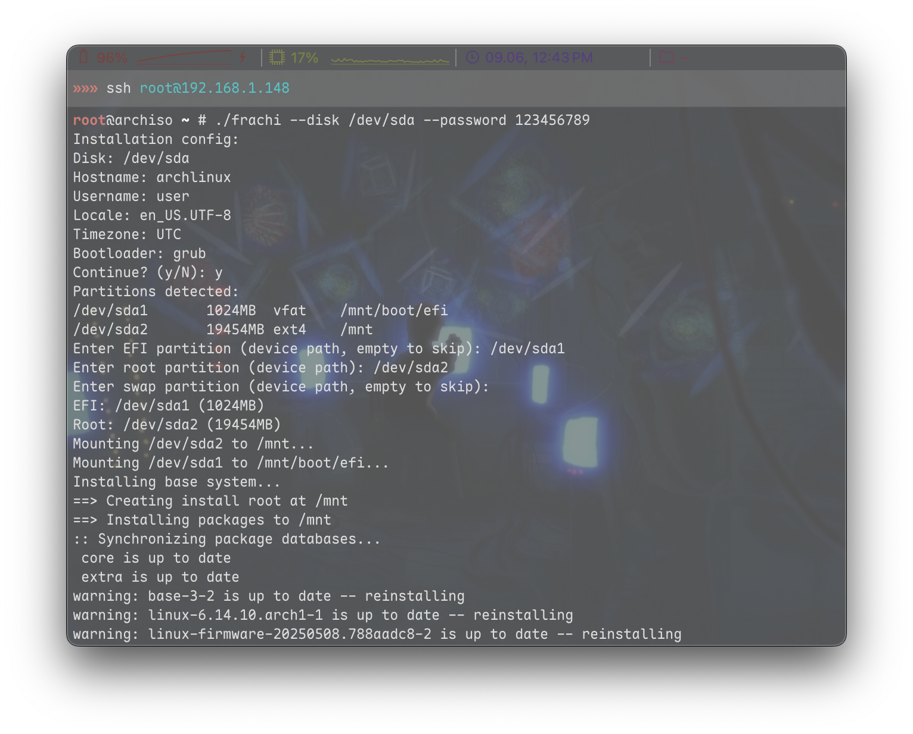

# frachi

**Fuck RACHInstall** — minimalistic, fast, and transparent Arch Linux installer written in Go. This is a modern, scriptable, and hackable alternative to archinstall, focused on clarity, full control, and real-time feedback.

> **Download prebuilt binary:**
> [Latest frachi build (nightly.link)](https://nightly.link/cryptexctl/frachi/workflows/build/main?preview)



## What is frachi?
frachi (Fuck RACHInstall) is a Go-based CLI installer for Arch Linux, designed for advanced users who want:
- Full control over disk selection, partitioning, and formatting
- Only the essential drivers and packages for a working system
- Real-time logs for all installation steps
- No magic, no hidden logic, no bloat
- Easy scripting and reproducibility

## Features
- **Written in Go**: fast, portable, easy to hack
- **No auto-partitioning**: you choose and format partitions yourself (or via CLI flags)
- **Interactive or CLI**: select partitions interactively or via `--efi`, `--root`, `--swap` flags
- **Automatic hardware detection**: only necessary drivers (NVIDIA, AMD, Intel) are installed
- **Real-time logs**: pacstrap and all key commands output directly to your terminal
- **Minimal base system**: only `base`, `linux`, `linux-firmware` and drivers
- **Grub by default**: only grub bootloader is supported (systemd-boot is NOT (i hate systemd))
- **Swap support**: if swap partition is present, it will be enabled
- **Safe**: never touches partitions you don't select and always asks before formatting
- **English only**: all output and prompts are in English

## Usage
1. **Prepare your disk** (partition and format manually, e.g. with `cfdisk`, `mkfs.ext4`, `mkfs.fat`, `mkswap`)
2. Boot into Arch ISO, copy frachi binary to the live system
3. Run:
   ```sh
   ./frachi --disk /dev/sda --password <root_password>
   ```
   Optionally add:
   - `--efi /dev/sda1` (EFI partition)
   - `--root /dev/sda2` (root partition)
   - `--swap /dev/sda3` (swap partition)
   - `--hostname`, `--username`, `--locale`, `--timezone`, etc.

   If you don't specify partitions, frachi will prompt you to enter device paths interactively.

4. Follow the prompts, confirm formatting if needed, and watch the real-time logs.
5. When finished, reboot into your new system!

## Example
```
./frachi --disk /dev/sda --password 123456789
```

## Troubleshooting
- **No partitions found on disk**: Make sure you have partitioned and formatted your disk. Only real partitions (like `/dev/sda1`, `/dev/sda2`) are shown.
- **Failed to mount partition**: Check that the partition is formatted (ext4 for root, vfat for EFI) and not in use.
- **pacstrap or chroot errors**: Check the logs in your terminal for details. Most issues are due to missing partitions, wrong formats, or missing network.
- **Any other issues**: Please open an issue on GitHub with your terminal output and a description. The developer has no problems, so if you do — report it!

## Contributing
PRs and issues are welcome. The code is intentionally simple and modular — hack away!